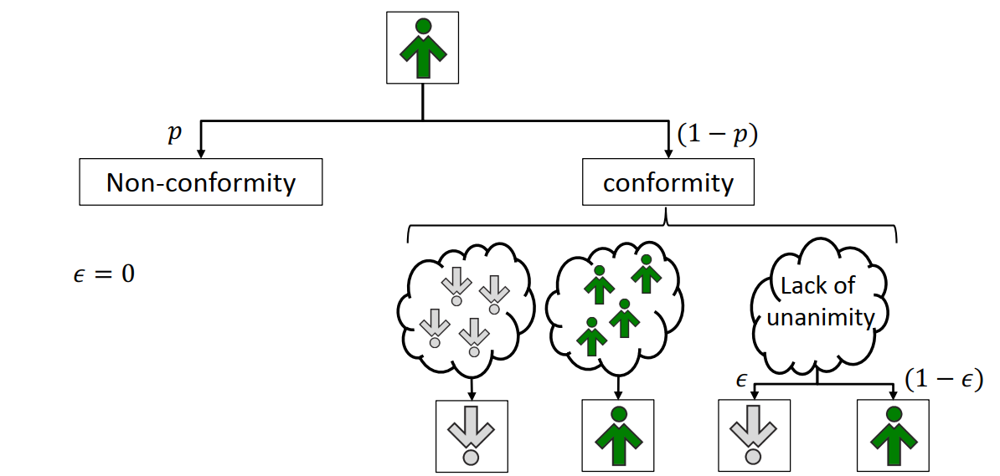
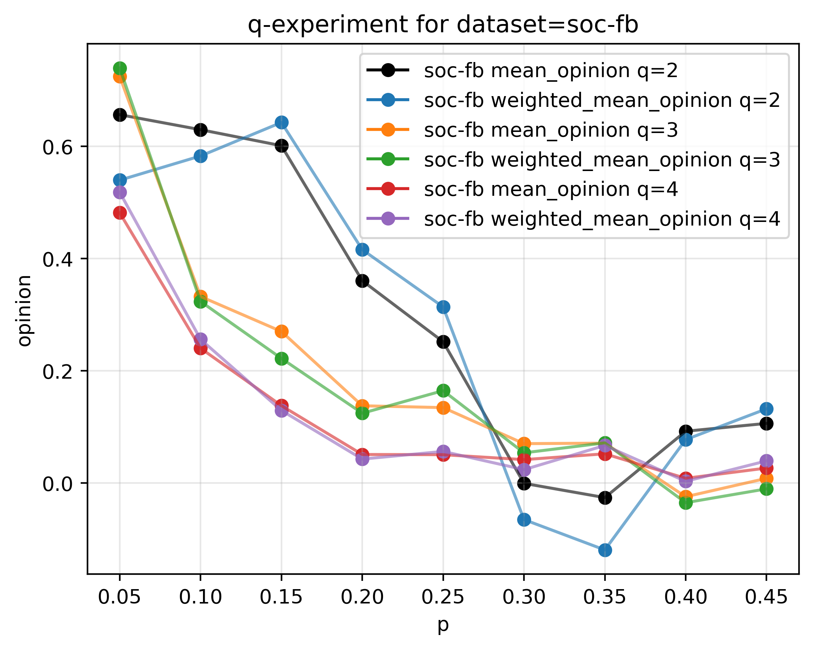
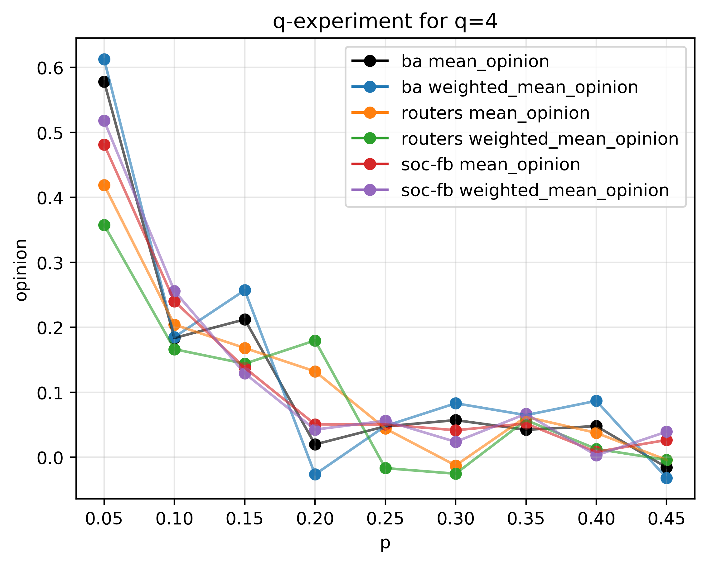
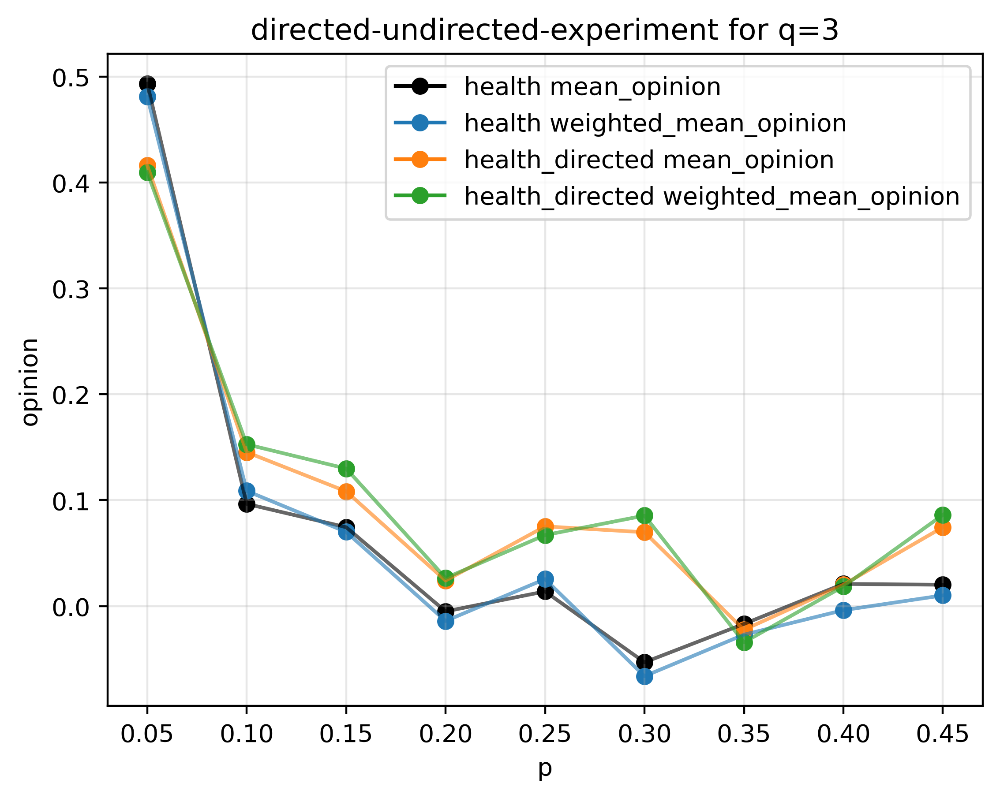
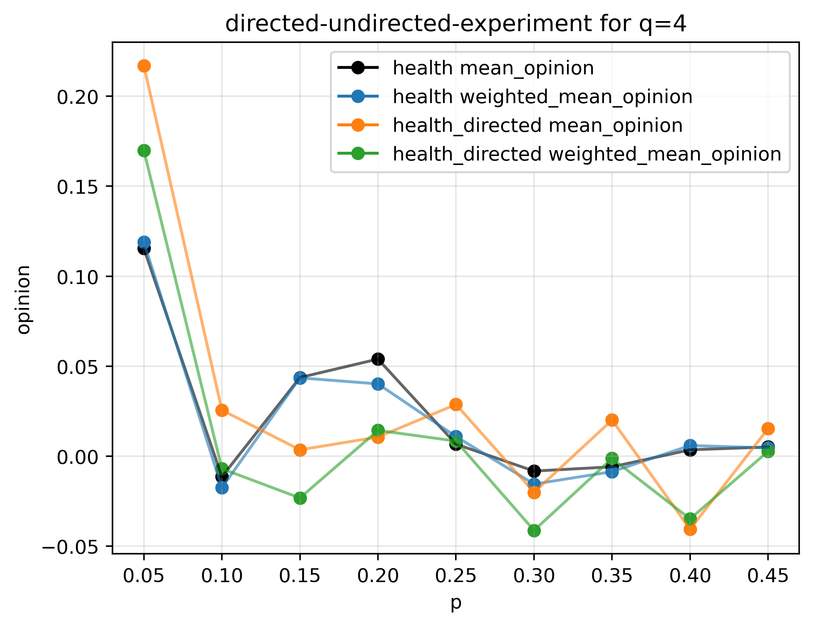
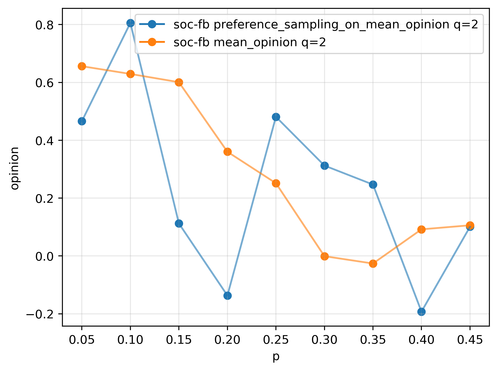

### Simulation of q-voter model on real networks (e.g. Facebook and Twittter)

In `q`-voter model there are N agents. Everyone has binary opinion +-1. The opinion of an agent may be changed under following social response:

- INDEPENDENCE - unwillingness to yield to the group pressure
- CONFORMITY - act like his/hers neighbors

The image below shows how the update rule is applied (from [1]).

The experiments which I conducted:

- **`q` experiment** - How the number of agents influence the dynamics of the system?
- **preference sampling experiment** - In basic form of the model we select `q` neighbours randomly. What if we select those agents based on their degree?
- **majority voting experiment** - Small extension to classic model. We are allowed to change opinion of the agents even if only the majority of the neighbours have the same state.
- **directed/undirected network experiment** - In real life relation between people could be one sided, like in directed network. Comparison of the simulation on undirected and directed network.

[1] Piotr Nyczka, Katarzyna Sznajd-Weron, and Jerzy Cisło. _Phase transi-tions in the q-voter model with two types of stochastic driving_. Physical Review E, 86(1):011105, 2012

**Metrics of used networks**
|                                                                      |    `<C>` | `<k_nn>` |   `<k>` |    `E` |   `N` |   `<l>` |
| -------------------------------------------------------------------: | -------: | -------: | ------: | -----: | ----: | ------: |
| [moreno-health](http://konect.uni-koblenz.de/networks/moreno_health) | 0.146677 |  9.85148 | 8.23553 |  10455 |  2539 | 4.55939 |
|           [soc-fb](http://networkrepository.com/socfb-Stanford3.php) | 0.241639 |   165.38 | 98.1027 | 568309 | 11586 | 2.81857 |
|          [routers](http://networkrepository.com/tech-routers-rf.php) | 0.246429 |  18.2824 | 6.27733 |   6632 |  2113 | 4.60742 |

*** 
***

| **`q`-experiment by dataset**  	|   **`q`-experiment by `q`** 	|  
|:--------:	|:------:	| 
|   	|   	| 
|   	|   	| 
|   	|   	| 

*** 
***

| **directed-undirected experiment**  	|   **directed-undirected experiment** 	|  
|:--------:	|:------:	| 
|   	|   	| 
|   	|   	| 

***
***

| **Preference sampling experiment**  	|   **Majority voting experiment** 	|  
|:--------:	|:------:	| 
|   	|   	| 
|   	| 
|   	|  

