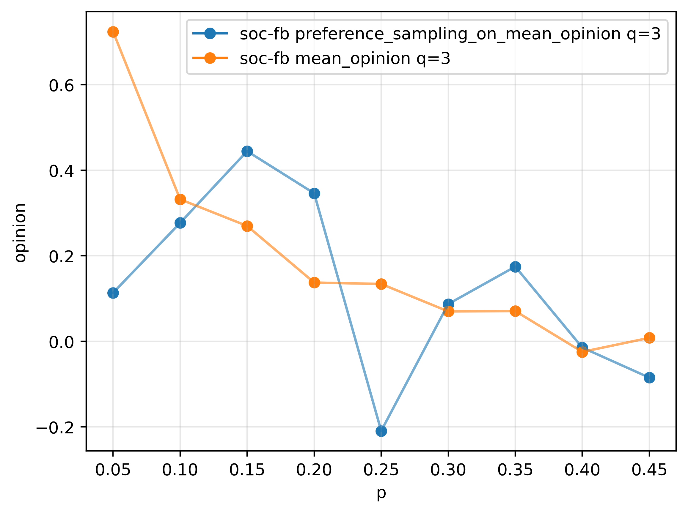

### Simulation of q-voter model on real networks (e.g. Facebook and Twittter)

| **Preference sampling experiment**  	|   **Majority voting experiment** 	|  
|:--------:	|:------:	| 
|   	|   	| 
|   	|   	| 
|   	|   	| 

**q experiment**
 - in progress ...
