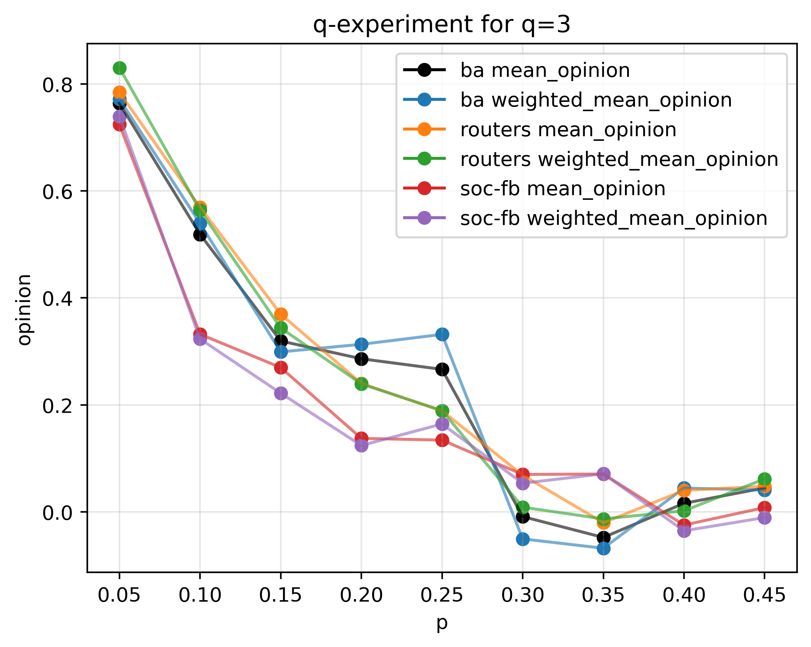
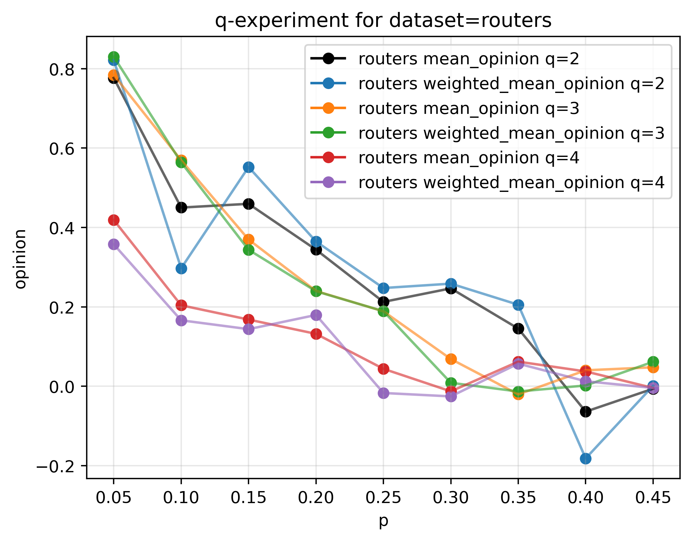
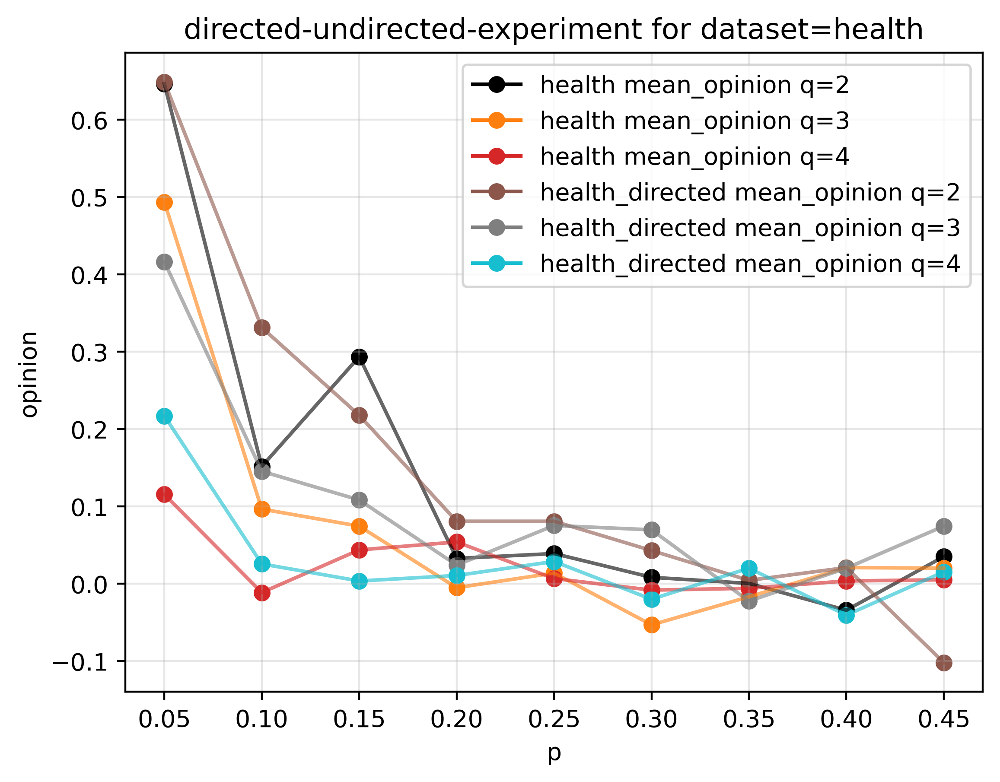

### Simulation of q-voter model on real networks (e.g. Facebook and Twittter)

**Metrics of used networks**
|    |        `<C>` |      `<k_nn>` |        `<k>` |      `E` |     `N` |       `<l>` |
|---:|---------:|----------:|---------:|-------:|------:|--------:|
|  [moreno-health](http://konect.uni-koblenz.de/networks/moreno_health) | 0.146677 |   9.85148 |  8.23553 |  10455 |  2539 | 4.55939 |
|  [soc-fb](http://networkrepository.com/socfb-Stanford3.php) | 0.241639 | 165.38    | 98.1027  | 568309 | 11586 | 2.81857 |
|  [routers](http://networkrepository.com/tech-routers-rf.php) | 0.246429 |  18.2824  |  6.27733 |   6632 |  2113 | 4.60742 |

*** 
***

| **`q`-experiment by dataset**  	|   **`q`-experiment by `q`** 	|  
|:--------:	|:------:	| 
|   	|   	| 
|   	|   	| 
|   	|   	| 

*** 
***

| **directed-undirected experiment**  	|   **`q`-experiment by `q`** 	|  
|:--------:	|:------:	| 
|   	|   	| 
|   	|   	| 

***
***

| **Preference sampling experiment**  	|   **Majority voting experiment** 	|  
|:--------:	|:------:	| 
|   	|   	| 
|   	|   	| 
|   	|   	| 

